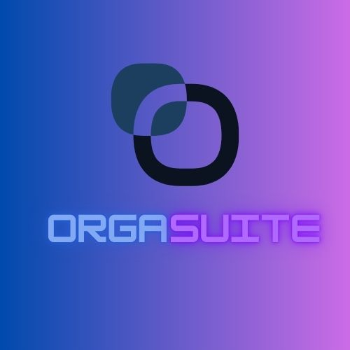

## OrgaSuite

#### Which Is created By My Team Swampus
#
OrgaSuite is your ultimate productivity companion designed to keep your tasks, notes, and schedule seamlessly organized! 🚀✨ Whether you're a student, professional, or just someone who loves staying on top of things, OrgaSuite has got you covered.
###
Key Features:
📝 Smart Note Organizer: Create, edit, and manage notes effortlessly.
📅 Task Manager: Plan your day and prioritize tasks like a pro.
⏳ Time Tracker: Keep track of your activities and boost productivity.
🎨 Custom Themes: Personalize your workspace with stunning themes.
💾 Data Sync & Backup: Save and restore your work securely.
###
Why Choose OrgaSuite?
💡 User-Friendly: A sleek, modern UI designed for simplicity.
⚡ Fast & Lightweight: Works smoothly without slowing down your system.
🔒 Secure: Your data stays private and safe.

Say goodbye to cluttered workflows and hello to an organized life with OrgaSuite! ✨

👉 Get started now and unlock your productivity potential! 💼
## 🐛Bug Report
For Bug Report Contact us on discord https://discord.gg/Y3Fs2YTu

## Authors

- [@NiamulAnkon](https://github.com/NiamulAnkon)
- [@Zesankawsar102](https://github.com/Zesankawsar102)
- [@tanviralamshovon](https://github.com/tanviralamshovon)

# OrgaSuite Documentation

# Overview
OrgaSuite is a powerful productivity software designed to help users manage their tasks, organize notes, and track time effectively. Whether you're a student, professional, or just someone looking to stay organized, OrgaSuite brings all your productivity tools into one intuitive platform.

Key Features:

Task management with priority levels and deadlines.
Note organizer supporting rich-text notes and categories.
Time tracking for sessions and breaks to boost productivity

# Note: 
All data is securely stored locally, but it's recommended to back up your files periodically.
## Installation

[Download OrgaSuite](https://github.com/NiamulAnkon/OrgaSuite/releases/tag/OrgaSuite) 🚀
## Feedback

If you have any feedback, please reach out to us at niamulankon966@gmai.com

## License

[MIT](https://github.com/NiamulAnkon/STUDYSUITE/blob/main/Licence)

